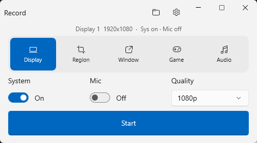
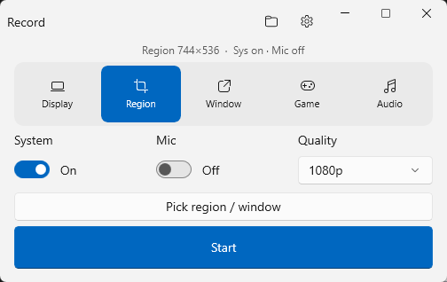
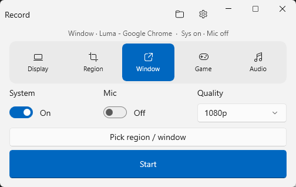
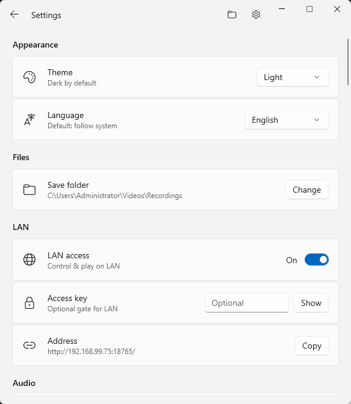

<div align="center">


# Luma

**A local-first screen recorder for Windows, with capture through libobs.**

[English](README.md) · [简体中文](README.zh-CN.md)


[Repository](https://github.com/flydmonkey/luma) · [AI Skill](.cursor/skills/luma-control/SKILL.md) · [OpenAPI](docs/openapi/openapi.json)



</div>

Luma records a display, a region, a window, or audio only, and it can take an annotated screenshot. There is no account. System audio and the microphone are controlled separately. Files stay in a folder you choose. Finishing work in the library runs on this PC.

Use Luma on the Windows desktop, open the same three pages from another device on your LAN, or let a compatible AI client call the published local API through the bundled `luma-control` skill.

Live capture and hardware encoding go through open-source [libobs](https://github.com/obsproject/obs-studio). Library tools such as trim and compress use FFmpeg when `ffmpeg.exe` is beside the app or on `PATH`.

## Why Luma

- **Local first** — no sign-in, and no upload of finished media during normal use.
- **Capture that matches the desktop** — display, region, window, audio only, plus a still screenshot with local text recognition.
- **A recording desk** — system audio, microphone, camera overlay, text / image / timestamp watermarks, pause, and segmentation.
- **A local library** — preview, rename, delete, repair, compress, trim, merge, burn captions, and mix background music.
- **LAN remote control** — start, pause, or stop the session already armed on the desktop, change a few settings, and list recordings.
- **An inspectable control surface** — the skill and OpenAPI describe only the routes this build actually serves.
- **Five interface languages** — English, Simplified Chinese, Traditional Chinese, Japanese, and Korean, or follow Windows.

## What you can capture

| Mode | What it records | Good for |
| --- | --- | --- |
| Display | One monitor | Presentations, classes, and full-desktop work |
| Region | A rectangle you select | One part of an application |
| Window | One selected window | Tutorials and focused app demos |
| Audio | System audio, microphone, or both, saved as `.m4a` | Meetings, narration, and audio notes |
| Screenshot | A still PNG, with optional local OCR | A frame you want to keep or copy |

<div align="center">


</div>

Quality presets run from 720p to 4K. The default frame rate is 30 fps, and hardware encoding is preferred. Video containers are `.mp4`, `.mkv`, `.mov`, and `.flv`. This build does not start game capture.

## AI skill and open API

The repository includes a [`luma-control`](.cursor/skills/luma-control/SKILL.md) skill. It talks to a running Luma instance through the LAN API. It does not click the WinUI window or invent routes from older Luma builds.

A remote recording uses the same API as the page:

1. Probe `GET /api/v1`. The factory address is `http://127.0.0.1:12345`.
2. If the port refuses the connection, LAN access is off. Stop and ask for it to be enabled.
3. Read `GET /api/v1/session`. List displays, windows, cameras, or microphones when a choice is needed.
4. `PUT /api/v1/target`, then `POST /api/v1/session/start`. Region and window need a chosen target. Game capture is rejected.
5. Pause or stop, then read the session again.

The API can also patch settings, list and rename recordings, delete one item after `confirm=true`, and queue compress, trim, or repair jobs. Merge, captions, and music stay on the desktop.

- [Skill](.cursor/skills/luma-control/SKILL.md)
- [Control reference](.cursor/skills/luma-control/reference.md)
- [OpenAPI](docs/openapi/openapi.json)

## Library

Finished files appear under **My Videos**, read from the save folder on this PC. Preview, rename, reveal, or delete them there. Processing writes a new file and leaves the original in place. Those editing actions are desktop actions; the LAN API lists and deletes only.

## Settings and LAN

<div align="center">

</div>

Settings cover theme, language, save folder, quality, container, audio devices, camera and watermark overlays, hotkeys, schedules, segmentation, tray behavior, and LAN access.

Turn on **LAN access** to open Luma from a browser on the same network. The browser is a remote panel. Capture and encoding still run on the Windows PC. Set an access key when the network is not fully trusted. The web page cannot turn LAN off or change the listen port.

The factory address is `http://127.0.0.1:12345`. The settings page shows the address other devices should use. The key header is `X-Record-Key` or `Authorization: Bearer`.

## Quick start

1. Build or unpack the x64 app and run `Luma.exe`.
2. Choose a capture mode, confirm system audio and the microphone, then select **Start**.
3. Screenshots use `Ctrl+Shift+S` by default.

The default folder is `Videos\Recordings`.

### System requirements

- 64-bit Windows 10 version 1809 or later
- x64
- Windows permission for screen, microphone, or camera capture when you use those features
- A network only for LAN control; recording itself works offline

## Hotkeys, tray, and automation

| Action | Default |
| --- | --- |
| Start recording | `Ctrl+Alt+R` |
| Pause or resume | `Ctrl+Alt+Shift+P` |
| Stop recording | `Ctrl+Alt+S` |
| Screenshot | `Ctrl+Shift+S` |

Closing the main window sends Luma to the tray by default. It can launch to the tray, start at sign-in, record on a schedule, or split a long take by duration or file size. Silent mode keeps a LAN-started session from pulling the window forward.

## Build from source

Install the [.NET 8 SDK](https://dotnet.microsoft.com/download/dotnet/8.0), then run:

```powershell
dotnet build src/Luma.App/Luma.App.csproj -c Debug -p:Platform=x64
dotnet test Luma.sln -c Debug -p:Platform=x64
```

The unpackaged executable is:

`src\Luma.App\bin\x64\Debug\net8.0-windows10.0.19041.0\win-x64\Luma.exe`

### GitHub release

Set `<Version>` in `Directory.Build.props` to the version you want to publish, then push a matching `vX.Y.Z` tag. The release workflow attaches both the zip and the exe installer to a draft GitHub Release.

## Documentation

- [Privacy policy](docs/legal/en/privacy.html)
- [Terms of use](docs/legal/en/terms.html)
- [OpenAPI](docs/openapi/openapi.json)
- [Repository](https://github.com/flydmonkey/luma)

Luma is developed by [flydmonkey](https://github.com/flydmonkey). The license is GPL-2.0-or-later because the app links libobs. See `LICENSE`.
